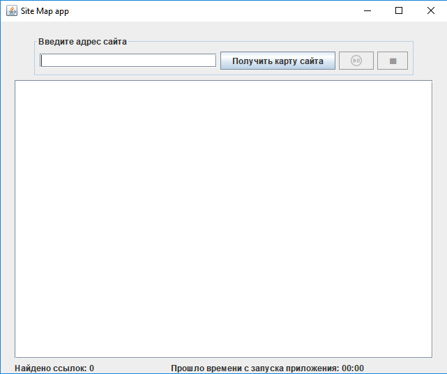

# Table of contents

## StudyProject №1
### [ToDoList](https://github.com/streamThread/SkillBox/tree/ToDoList/12_SpringBootWebDevelopment/ToDoList)

Spring application example (the development continues). You can save and modify the to-do list. Api documentation - [swagger](https://myapp234123.herokuapp.com/swagger-ui.html). 
Link to the deployment to heroku https://myapp234123.herokuapp.com/

username: user

password: password

### Technology stack :
* Spring
* Thymeleaf
* HTML
* MySQL
* Lombok
* Swagger
* Docker
* Maven

## StudyProject №2
### [Site Map](https://github.com/streamThread/SkillBox/tree/master/11_Multithreading/SiteMapByForkJoin)

Swing application. Creates a site map using a recursive algorithm
### Technology stack :
* Swing
* MultiThreading (ForkJoinPool)
* jsoup
* Log4j2
* Lombok
* Maven

## StudyProject №3
### [Transactions](https://github.com/streamThread/SkillBox/tree/master/11_Multithreading/Transactions)

Simulation of the operation of bank transfer services in a multithreaded mode
### Technology stack :
* MultiThreading
* Log4j2
* Lombok
* Allure
* Maven

## StudyProject №4
### [Site Map By ForkJoin](https://github.com/streamThread/SkillBox/tree/master/11_Multithreading/SiteMapByForkJoin)

Makes a site map according to the model.
### Technology stack :
* JSoup
* Log4j2
* Lombok
* gson
* Maven

## StudyProject №5
### [GMail Tests](https://github.com/streamThread/GMailTests)

Testing Gmail by Selenium
### Technology stack :
* Selenium
* Allure
* Junit
* Maven

## StudyProject №6
### [SQL](https://github.com/streamThread/SkillBox/tree/master/10_SQLAndHibernate/SQL%2010.2.3)

Hibernate example
### Technology stack :
* MySQL
* Hibernate
* Lombok 
* Maven

## StudyProject №7
### [Metro Parsing](https://github.com/streamThread/SkillBox/tree/master/09_FilesAndNetwork/MetroParsing)

Parsing metro data from wikipedia page to json file
### Technology stack :
* JSoup
* Json
* Maven

## StudyProject №8
### [Image Resizer](https://github.com/streamThread/SkillBox/tree/master/11_Multithreading/ImageResizer)

Multi-threaded image compression
### Technology stack :
* Lombok
* java.awt.*
* Maven

## StudyProject №9
### [Parse CSV](https://github.com/streamThread/ParseCSV/blob/master/src/main/java/BankStatementOperations.java)

Parsing a bank statement in CSV format
### Technology stack :
* opencsv
* Maven

## Other small projects
### [StudyProjects](https://github.com/streamThread/StudyProjects)
